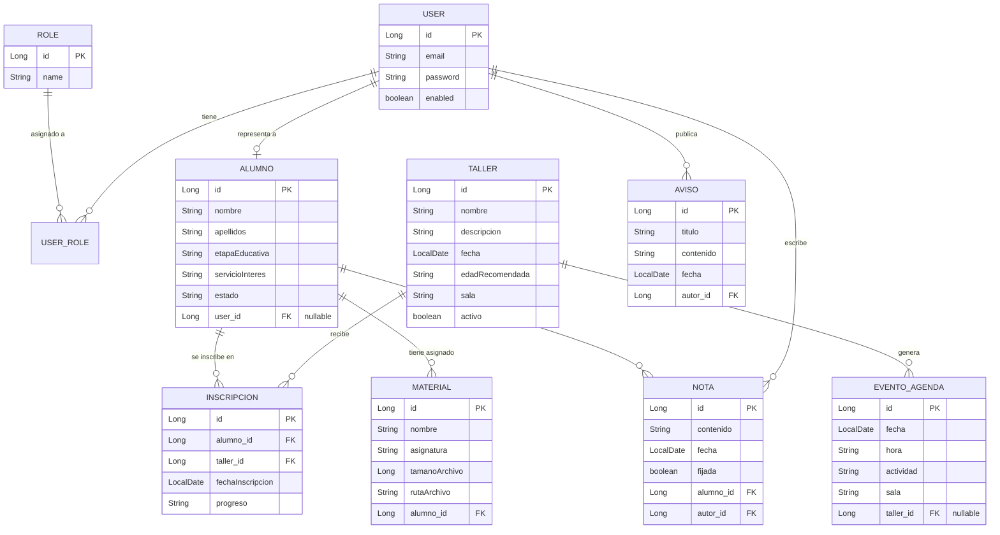

#  API Movies

## 🔍 Índice

- [Descripción](#-descripción)
- [Tecnologías utilizadas](#-tecnologías-utilizadas)
- [Instalación](#%EF%B8%8F-instalación)
- [Estructura de carpetas](#-estructura-de-carpetas)
- [Diagrama de base de datos](#-diagrama-de-base-de-datos)
- [Pruebas](#-pruebas)
- [Tests](#-tests)
- [Autora](#%EF%B8%8F-autora)

---

## 📝 Descripción

API REST del backend de **EducAlba**, academia de refuerzo educativo y talleres extraescolares. Desarrollado con **Spring Boot** y **Spring Security** (autenticación mediante Basic Auth con sesión por cookies), persistencia con **Spring Data JPA** sobre una base de datos **PostgreSQL dockerizada**, y tests unitarios y de integración con **Testcontainers**.

Este backend da servicio al frontend en Vue 3 ([web-educAlba-frontend](https://github.com/duran-ni/web-educAlba-frontend)), gestionando la autenticación de usuarios (familias y administradores), talleres, inscripciones, materiales, notas y avisos de la academia.
---

## 💻 Tecnologías utilizadas

---

## 🛠️ Instalación

**1.** Clonar el repositorio:

```bash

```

**2.** Compilar el proyecto:

```bash

```

**3.** Ejecutar la aplicación:

```bash

```

---

## 📁 Estructura de carpetas

```

```
---


## Diagrama de base de datos



---

## 📷 Pruebas

---

## ✅ Tests

---

## ✍️ Autora

duran-ni
